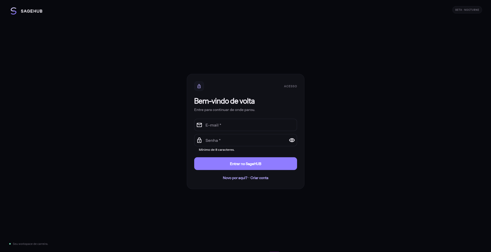
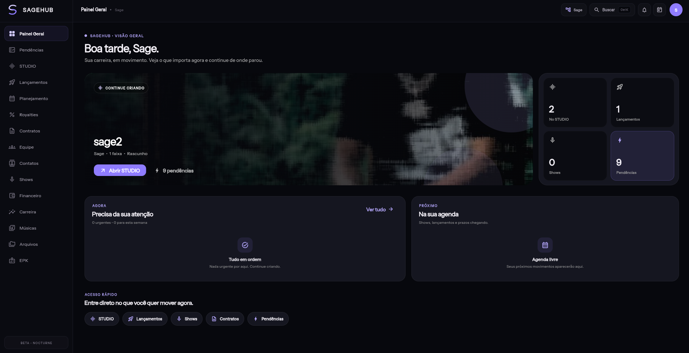
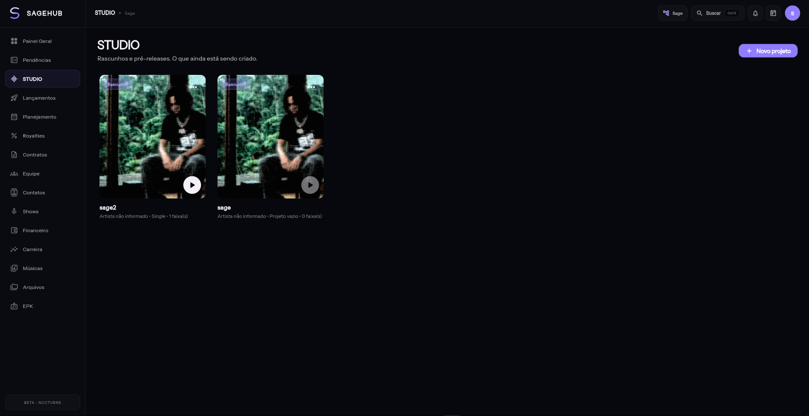
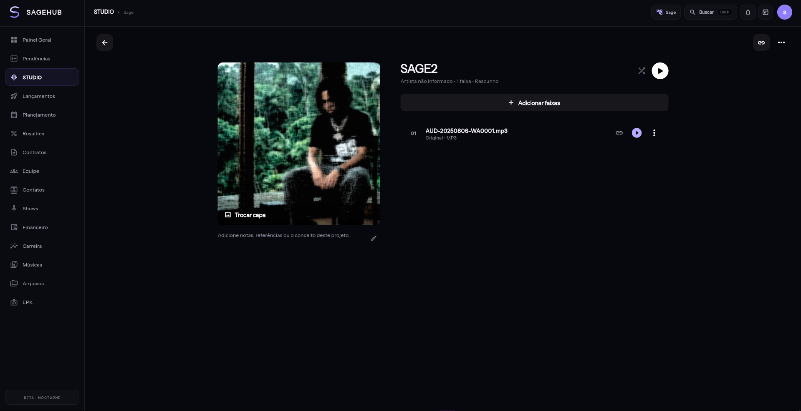
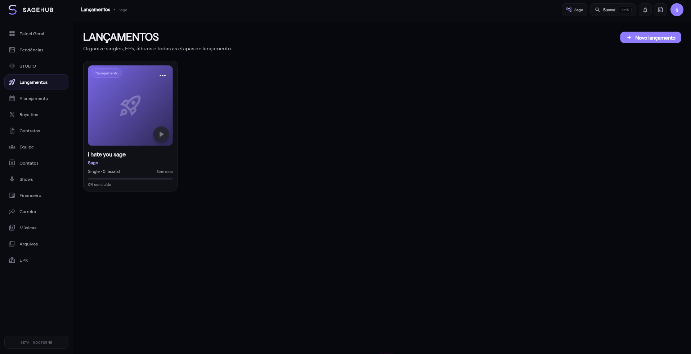
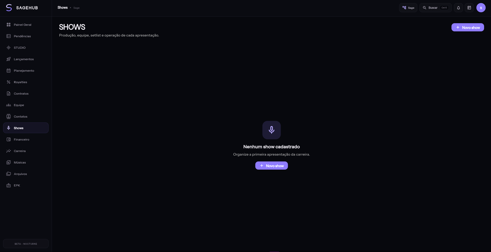
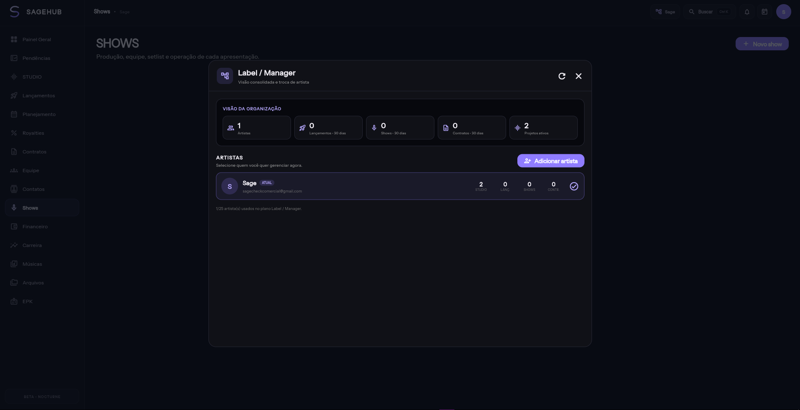

# SageHUB 🎵

> Plataforma para organização e gestão da carreira de artistas.

O **SageHUB** é um produto digital em desenvolvimento criado para centralizar diferentes áreas da carreira de artistas independentes, equipes e organizações musicais em uma única aplicação.

Este repositório apresenta o projeto como **case de desenvolvimento**. O código-fonte principal é privado.

---

## 📱 Sobre o projeto

O SageHUB foi desenvolvido com foco em simplificar tarefas profissionais que normalmente ficam espalhadas entre planilhas, aplicativos, mensagens e serviços diferentes.

A plataforma reúne recursos para organização de músicas, lançamentos, shows, arquivos, equipe e outras áreas da carreira artística.

---

## 📸 Screenshots

### 🔐 Login

### 🏠 Dashboard

### 🎵 STUDIO

### 🎧 Projeto no STUDIO

### 🚀 Lançamentos

### 🎤 Shows

### 👥 Gestão de Artistas

---

## 🚀 Principais funcionalidades

* 🎵 Gestão de músicas e projetos
* 🎧 Upload e reprodução de áudio
* 🚀 Planejamento de lançamentos
* 🎤 Organização de shows
* 👥 Gestão de equipe
* 📅 Calendário e organização
* 📁 Biblioteca de arquivos
* 🔔 Central de notificações
* 👤 Suporte a múltiplos artistas
* 🔐 Autenticação e controle de acesso
* ☁️ Armazenamento privado de mídia

---

## 🛠️ Tecnologias

### Aplicação

* Flutter
* Dart

### Backend

* Supabase
* PostgreSQL
* Row Level Security
* Edge Functions
* APIs

### Infraestrutura e mídia

* Backblaze B2
* Signed URLs
* Armazenamento privado

### Ferramentas

* Git
* GitHub
* Visual Studio Code
* Android Studio

---

## 🏗️ Arquitetura

O projeto utiliza uma arquitetura que separa aplicação, autenticação, banco de dados e armazenamento de mídia.

O **Supabase** é utilizado para autenticação, PostgreSQL, regras de acesso e serviços de backend.

O armazenamento de mídia utiliza infraestrutura privada com **Backblaze B2**, com acesso controlado e URLs temporárias para arquivos protegidos.

---

## 📱 Plataformas

* Android
* Web

---

## 🔒 Código-fonte

O código-fonte completo do SageHUB não está disponível publicamente porque o projeto corresponde a um produto em desenvolvimento.

Este repositório existe exclusivamente para apresentar o projeto, as tecnologias utilizadas e as soluções desenvolvidas.

---

## 👨‍💻 Desenvolvedor

**Alan Sales**

[LinkedIn](https://www.linkedin.com/in/sagecheck) • [GitHub](https://github.com/sagecheck)

---

## 🚧 Status

Em desenvolvimento ativo.
